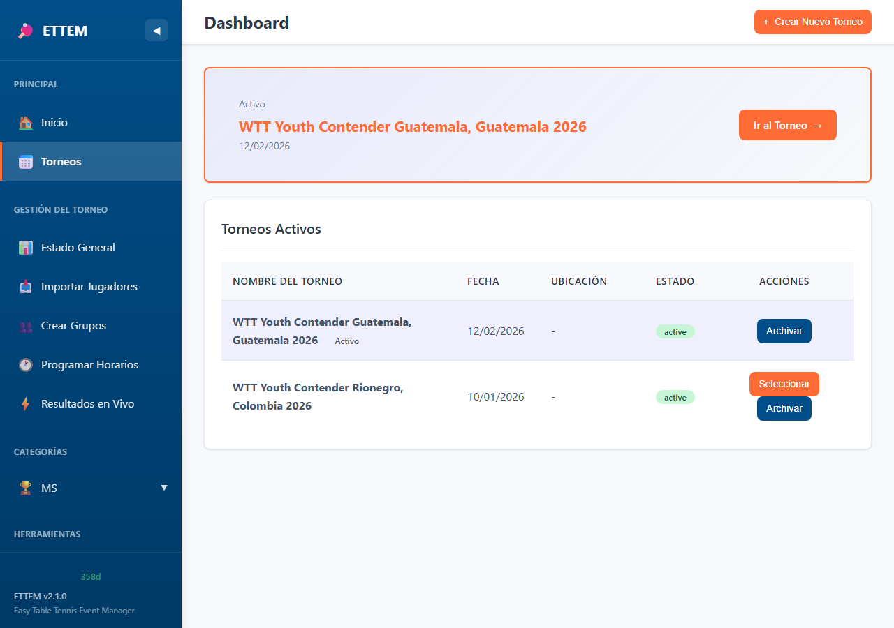
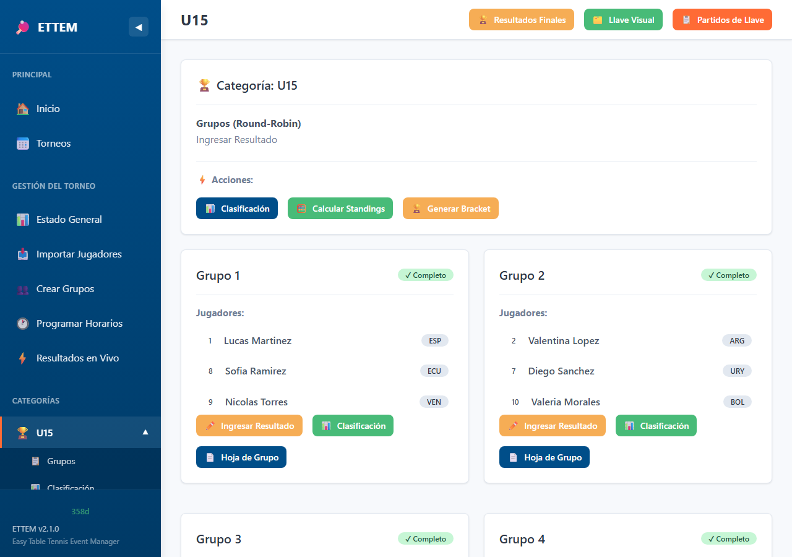
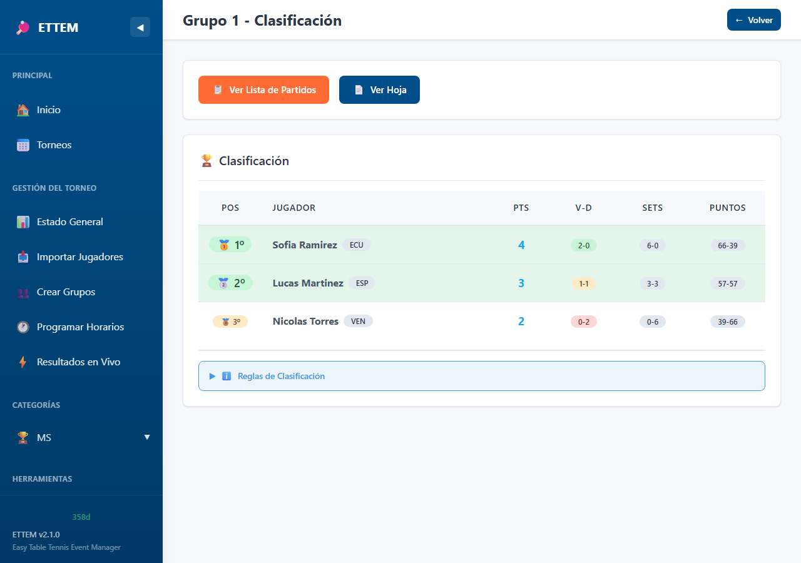
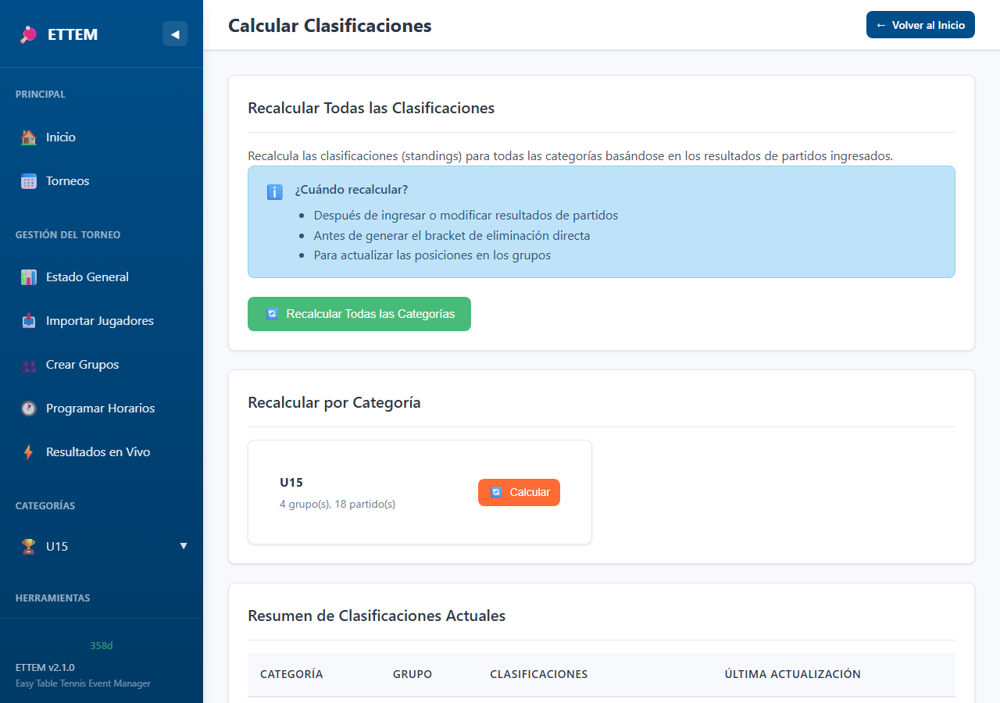
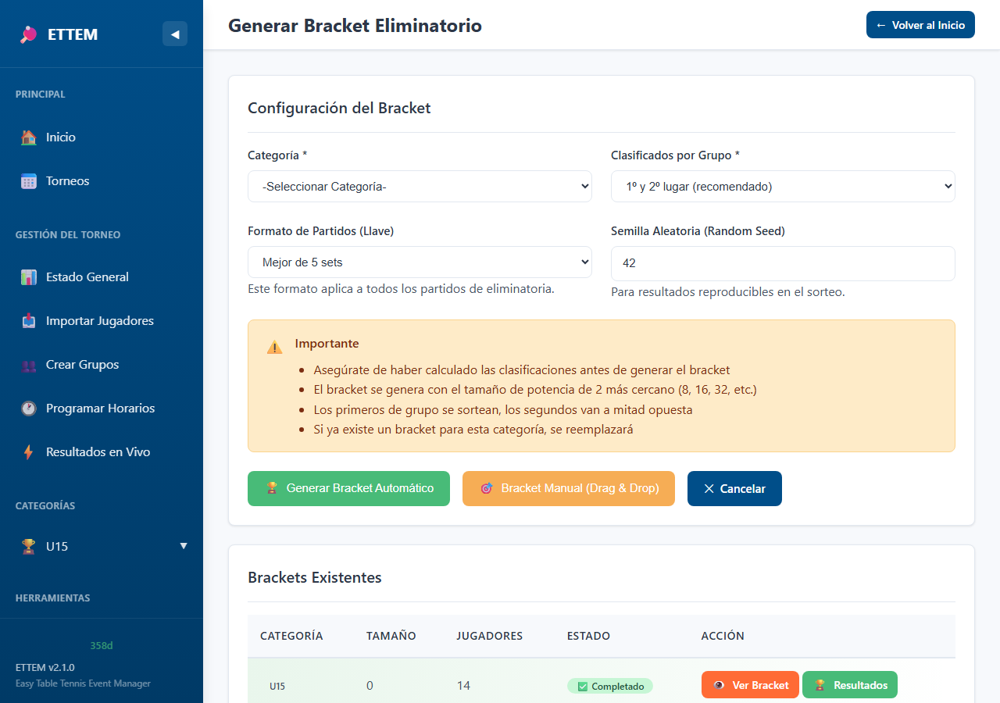
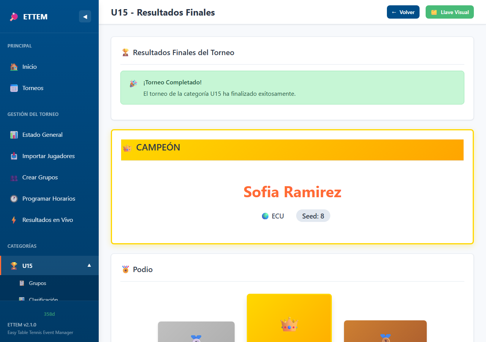
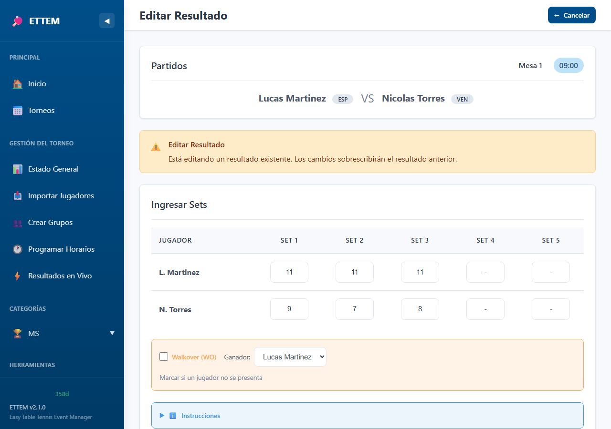
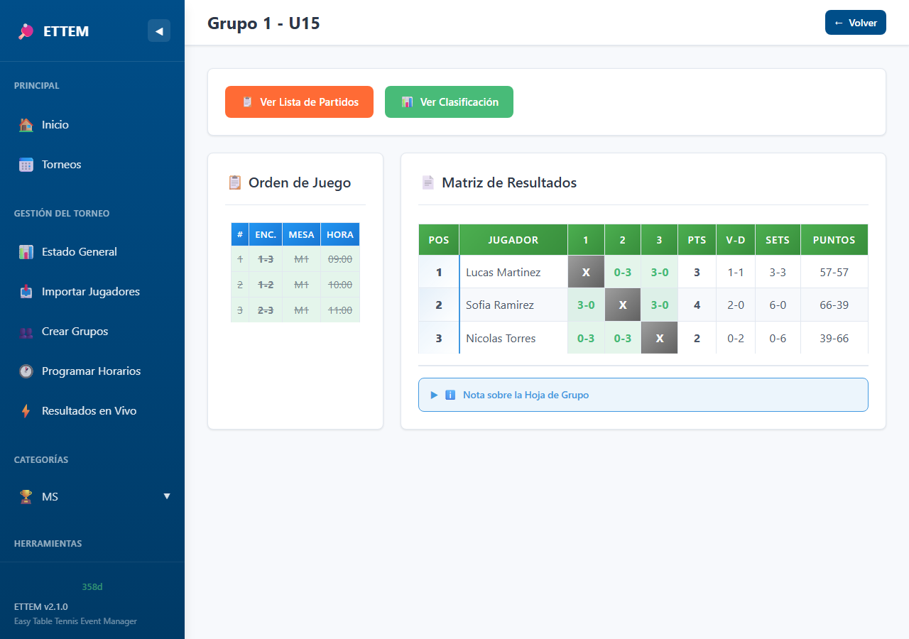

# ETTEM v2.2 - Capacidades del Sistema

**Easy Table Tennis Event Manager**

Sistema integral de gestion de torneos de tenis de mesa. Funciona 100% offline con base de datos local (SQLite), panel web completo y ejecutable standalone para Windows.

---

## Tabla de Contenido

1. [Gestion de Torneos y Categorias](#1-gestion-de-torneos-y-categorias)
2. [Registro de Jugadores](#2-registro-de-jugadores)
3. [Fase de Grupos (Round Robin)](#3-fase-de-grupos-round-robin)
4. [Standings y Desempates](#4-standings-y-desempates)
5. [Fase Eliminatoria (Knockout Bracket)](#5-fase-eliminatoria-knockout-bracket)
6. [Ingreso de Resultados](#6-ingreso-de-resultados)
7. [Validacion de Puntajes (Reglas ITTF)](#7-validacion-de-puntajes-reglas-ittf)
8. [Scheduler (Mesas y Horarios)](#8-scheduler-mesas-y-horarios)
9. [Operacion en Vivo](#9-operacion-en-vivo)
10. [Marcador de Arbitro (Movil)](#10-marcador-de-arbitro-movil)
11. [Pantalla Publica (TV/Monitor)](#11-pantalla-publica-tvmonitor)
12. [Centro de Impresion](#12-centro-de-impresion)
13. [Configuracion y Personalizacion](#13-configuracion-y-personalizacion)
14. [Sistema de Licencias](#14-sistema-de-licencias)
15. [Distribucion y Ejecucion](#15-distribucion-y-ejecucion)
---

## 1. Gestion de Torneos y Categorias

Permite crear y administrar multiples torneos, cada uno con multiples categorias siguiendo la nomenclatura estandar ITTF.

| Funcion | Descripcion |
|---------|-------------|
| Crear torneo | Nombre, fecha, sede |
| Crear categorias | Nomenclatura ITTF (U11BS, U13GS, MS, WS, etc.) |
| Dashboard | Vista general de todas las categorias con estado actual |
| Estado del torneo | Resumen de progreso por categoria (jugadores, grupos, bracket) |

### Categorias ITTF Soportadas

| Codigo | Descripcion |
|--------|-------------|
| U11BS / U11GS | Sub-11 Varones / Damas Singles |
| U13BS / U13GS | Sub-13 Varones / Damas Singles |
| U15BS / U15GS | Sub-15 Varones / Damas Singles |
| U17BS / U17GS | Sub-17 Varones / Damas Singles |
| U19BS / U19GS | Sub-19 Varones / Damas Singles |
| U21BS / U21GS | Sub-21 Varones / Damas Singles |
| MS / WS | Mayores Varones / Damas Singles |

### Capturas de Pantalla

| Pantalla | Referencia |
|----------|------------|
| Dashboard principal |  |
| Lista de torneos |  |
| Estado del torneo |  |
| Detalle de categoria |  |

---

## 2. Registro de Jugadores

Dos metodos de registro: importacion masiva desde archivo CSV o ingreso manual uno por uno.

| Funcion | Descripcion |
|---------|-------------|
| Importar desde CSV | Carga masiva con vista previa y validacion |
| Agregar manualmente | Formulario individual por jugador |
| Columnas CSV | `id`, `nombre`, `apellido`, `genero`, `pais_cd`, `ranking_pts`, `categoria` |
| Pais (ISO-3) | Codigo de 3 letras (ESP, MEX, ARG, URU, PAR, etc.) |
| Ranking | Puntos de ranking para seeding; 0 para jugadores sin ranking |
| Validacion | Verificacion de formato, campos requeridos y duplicados |

### Formato CSV

```csv
id,nombre,apellido,genero,pais_cd,ranking_pts,categoria
1,Juan,Perez,M,ESP,1200,U15BS
2,Maria,Garcia,F,ESP,1150,U15GS
3,Pedro,Lopez,M,MEX,0,U15BS
```

### Captura de Pantalla

| Pantalla | Referencia |
|----------|------------|
| Importar jugadores |  |

---

## 3. Fase de Grupos (Round Robin)

Generacion automatica de grupos con snake seeding basado en ranking. Soporte para drag-and-drop manual.

| Funcion | Descripcion |
|---------|-------------|
| Snake seeding | Distribucion equilibrada por ranking (1,4,5,8 / 2,3,6,7) |
| Tamano de grupo | Configurable: 3 o 4 jugadores por grupo |
| Jugadores que avanzan | Configurable: 1 o 2 por grupo |
| Drag-and-drop | Reordenar jugadores manualmente antes de confirmar |
| Fixtures automaticos | Generacion de todos contra todos (metodo circular) |
| Partidos de grupo | Vista de todos los partidos con estado (pendiente, en juego, completado) |
| Standings de grupo | Clasificacion automatica con detalle de desempates |

### Capturas de Pantalla

| Pantalla | Referencia |
|----------|------------|
| Crear grupos |  |
| Partidos de grupo |  |
| Standings de grupo |  |

---

## 4. Standings y Desempates

Calculo automatico de clasificaciones con sistema avanzado de desempate aplicado exclusivamente entre los jugadores empatados.

### Sistema de Puntos

| Resultado | Puntos de torneo |
|-----------|-----------------|
| Victoria | 2 |
| Derrota (jugada) | 1 |
| Walkover (perdedor) | 0 |

### Criterios de Desempate (en orden)

| Prioridad | Criterio | Descripcion |
|-----------|----------|-------------|
| 1 | Ratio de sets | Sets ganados / sets perdidos (entre empatados) |
| 2 | Ratio de puntos | Puntos ganados / puntos perdidos (entre empatados) |
| 3 | Seed | El jugador con mejor seed gana el desempate |

### Capturas de Pantalla

| Pantalla | Referencia |
|----------|------------|
| Standings de categoria |  |
| Calcular standings |  |

---

## 5. Fase Eliminatoria (Knockout Bracket)

Generacion de llave eliminatoria con colocacion automatica siguiendo reglas ITTF o manual con drag-and-drop.

### Modo Automatico

| Funcion | Descripcion |
|---------|-------------|
| Tamano del bracket | Siguiente potencia de 2 >= cantidad de clasificados |
| G1 (mejor 1er lugar) | Posicion superior del bracket |
| G2 (2do mejor 1er lugar) | Posicion inferior del bracket |
| Otros 1ros | Sorteo aleatorio en posiciones predefinidas |
| 2dos lugares | Mitad opuesta a su grupo correspondiente |
| BYEs | Colocados automaticamente segun reglas ITTF |
| Mismo pais | Anotacion visual si hay compatriotas en primera ronda |

### Modo Manual (Drag-and-Drop)

| Funcion | Descripcion |
|---------|-------------|
| Arrastrar jugadores | Mover a cualquier posicion del bracket |
| Intercambiar posiciones | Arrastrar un jugador sobre otro para intercambiar |
| Validacion de grupo | No permite jugadores del mismo grupo en la misma mitad |
| Alerta de pais | Advertencia visual si compatriotas quedan en primera ronda |
| BYEs preposicionados | Segun reglas oficiales ITTF |

### Capturas de Pantalla

| Pantalla | Referencia |
|----------|------------|
| Bracket |  |
| Generar bracket |  |
| Resultados de categoria |  |

---

## 6. Ingreso de Resultados

Formulario de ingreso de resultados con validacion en tiempo real, tanto para fase de grupos como eliminatoria.

| Funcion | Descripcion |
|---------|-------------|
| Ingreso por sets | Formato `XX-YY` con validacion ITTF |
| Avance automatico | El ganador del bracket avanza a la siguiente ronda |
| Walkover (W.O.) | Marcar que un jugador no se presento |
| Editar resultado | Modificar un resultado ya ingresado |
| Estado del partido | Pendiente, en juego, completado |

### Captura de Pantalla

| Pantalla | Referencia |
|----------|------------|
| Ingresar resultado |  |

---

## 7. Validacion de Puntajes (Reglas ITTF)

Validacion completa de resultados siguiendo las reglas oficiales de la ITTF.

### Reglas de Sets

| Regla | Descripcion |
|-------|-------------|
| Puntos para ganar | 11 puntos por set |
| Diferencia minima | 2 puntos de diferencia |
| Deuce | A partir de 10-10, se juega hasta +2 (12-10, 13-11, 14-12, etc.) |

### Formatos de Partido

| Formato | Sets para ganar | Sets maximos |
|---------|----------------|--------------|
| Best of 3 (Bo3) | 2 | 3 |
| Best of 5 (Bo5) | 3 | 5 |
| Best of 7 (Bo7) | 4 | 7 |

### Configuracion Flexible

| Funcion | Descripcion |
|---------|-------------|
| Formato por categoria | Cada categoria puede tener su propio formato |
| Formato diferente grupos/bracket | Ej: Bo3 en grupos, Bo5 en eliminatoria |
| Validacion automatica | El sistema rechaza puntajes invalidos con mensaje de error |

---

## 8. Scheduler (Mesas y Horarios)

Sistema completo de programacion de partidos por mesa y franja horaria.

| Funcion | Descripcion |
|---------|-------------|
| Configurar mesas | Definir numero y nombre de mesas del recinto |
| Crear sesiones | Sesiones con hora de inicio, duracion de slot y cantidad de slots |
| Asignar partidos | Asignar partido a celda especifica (mesa + hora) |
| Grilla visual | Vista de todas las asignaciones en formato de tabla |
| Finalizar sesion | Bloquear partidos asignados al terminar |
| Reabrir sesion | Desbloquear para hacer cambios si es necesario |
| Fecha preseleccionada | Al crear sesion, la fecha del dia actual viene por defecto |

### Capturas de Pantalla

| Pantalla | Referencia |
|----------|------------|
| Scheduler |  |
| Grilla del scheduler |  |

---

## 9. Operacion en Vivo

Panel de administracion para monitorear y gestionar resultados durante el torneo en tiempo real.

| Funcion | Descripcion |
|---------|-------------|
| Panel de resultados en vivo | Vista de todos los partidos en curso agrupados por horario |
| Auto-refresh | Actualizacion automatica cada 10 segundos |
| Filtro por torneo | Solo muestra partidos del torneo activo |
| Estados homologados | Los mismos badges/estilos en todas las vistas |

### API de Scores en Vivo

| Endpoint | Metodo | Descripcion |
|----------|--------|-------------|
| `/api/live-scores` | GET | Todos los partidos activos del torneo actual |
| `/api/live-score/{id}` | POST | Actualizar score de un partido (requiere token) |
| `/api/table/{id}/heartbeat` | POST | Mantener el bloqueo de mesa activo |

### Seguridad

| Funcion | Descripcion |
|---------|-------------|
| Validacion de token | Solo el dispositivo con el token correcto puede enviar scores |
| Filtro por torneo | La API solo devuelve datos del torneo actualmente activo |

### Captura de Pantalla

| Pantalla | Referencia |
|----------|------------|
| Resultados en vivo |  |

---

## 10. Marcador de Arbitro (Movil)

Interfaz optimizada para celular que permite al arbitro controlar el marcador de la mesa asignada.

### Acceso

| Metodo | Descripcion |
|--------|-------------|
| Codigo QR | Escanear el QR impreso en la mesa |
| URL directa | `http://<IP-del-servidor>:8000/mesa/{numero}` |
| Requisito de red | El celular debe estar en la misma red WiFi que el servidor |

### Modos de Operacion

| Modo | Descripcion |
|------|-------------|
| Punto por punto | Botones grandes +/- para anotar cada punto individualmente |
| Resultado por set | Ingresar el marcador final de cada set (ej: 11-9) |

### Funciones del Marcador

| Funcion | Descripcion |
|---------|-------------|
| Seleccion de partido | Lista de partidos programados para el dia actual |
| Filtro inteligente | Solo muestra partidos con ambos jugadores asignados (no TBD/BYE) |
| Boton actualizar | Refrescar lista de partidos sin recargar la pagina |
| Botones +/- grandes | Interfaz tactil optimizada para celular |
| Animacion flash | Feedback visual al anotar un punto |
| Historial de sets | Sets completados con colores diferenciados por jugador |
| Intercambiar lados | Cambiar posicion visual de los jugadores |
| Cambio automatico de lados | Basado en el numero de set (segun reglas ITTF) |
| Walkover | Marcar que un jugador no se presento |
| Sincronizacion | El resultado se envia al servidor al completar cada set |

### Sistema de Bloqueo de Mesas

| Funcion | Descripcion |
|---------|-------------|
| Un dispositivo por mesa | Solo un celular puede controlar cada mesa a la vez |
| Bloqueo por sesion | Basado en cookies del navegador |
| Timeout por inactividad | El bloqueo expira si el dispositivo deja de enviar heartbeat |
| Desbloqueo desde admin | El administrador puede liberar una mesa desde el panel |
| Mensaje de mesa ocupada | Segundo dispositivo recibe notificacion clara |

### Capturas de Pantalla

| Pantalla | Referencia |
|----------|------------|
| Configurar mesas |  |
| Codigos QR |  |
| Marcador de arbitro |  |

---

## 11. Pantalla Publica (TV/Monitor)

Vista optimizada para proyectar en pantallas grandes (TV, monitor, proyector) en la sede del torneo.

| Funcion | Descripcion |
|---------|-------------|
| Partidos en vivo | Marcador actual de partidos en progreso (maximo 4 simultaneos) |
| Resultados recientes | Ultimos 10 partidos completados |
| Proximos partidos | Partidos programados pendientes |
| Auto-refresh | Actualizacion automatica cada 5 segundos |
| Rotacion automatica | Alterna entre resultados y proximos partidos cada 5 segundos |
| Tema oscuro | Optimizado para pantallas grandes y ambientes con luz variable |
| Responsive | Compatible con Full HD (1080p) y 4K |
| Filtro por torneo | Solo muestra partidos del torneo activo |

### Acceso

```
http://<IP-del-servidor>:8000/display
```

Se recomienda usar el modo de pantalla completa del navegador (F11).

### Captura de Pantalla

| Pantalla | Referencia |
|----------|------------|
| Pantalla publica |  |

---

## 12. Centro de Impresion

Hub centralizado para generar e imprimir todos los documentos del torneo.

### Documentos Disponibles

| Documento | Descripcion | Uso tipico |
|-----------|-------------|------------|
| Hoja de partido | Formulario para que el arbitro anote el resultado | Una por partido |
| Hoja de grupo | Matriz de resultados del grupo completo | Una por grupo |
| Arbol de bracket | Visualizacion de la llave eliminatoria completa | Una por categoria |
| Grilla de scheduler | Asignaciones de mesas y horarios de la sesion | Una por sesion |

### Proceso de Impresion

1. Seleccionar tipo de documento
2. Elegir categoria y/o grupo
3. Vista previa en pantalla
4. Imprimir con Ctrl+P o guardar como PDF

### Capturas de Pantalla

| Pantalla | Referencia |
|----------|------------|
| Centro de impresion |  |
| Hoja de grupo |  |
| Arbol de bracket |  |

---

## 13. Configuracion y Personalizacion

### Idioma (i18n)

| Idioma | Descripcion |
|--------|-------------|
| Espanol (ES) | Interfaz completa en espanol |
| Ingles (EN) | Interfaz completa en ingles |

El cambio de idioma es inmediato y afecta toda la interfaz.

### Tema Visual

| Tema | Descripcion |
|------|-------------|
| Claro | Fondo blanco, ideal para uso diurno |
| Oscuro | Fondo oscuro, ideal para ambientes con poca luz |

### Interfaz Web

| Funcion | Descripcion |
|---------|-------------|
| Barra lateral | Navegacion principal con acceso a todas las secciones |
| Responsive | Se adapta a diferentes tamanos de pantalla |
| Badges homologados | Los mismos estilos para estados en todas las vistas |
| Auto-refresh | Las vistas con datos en vivo se actualizan automaticamente |

---

## 14. Sistema de Licencias

Sistema de activacion con clave unica por cliente.

| Funcion | Descripcion |
|---------|-------------|
| Activacion simple | Ingresar clave de licencia una sola vez |
| Validacion offline | No requiere conexion a internet para validar |
| Seguridad | Claves firmadas digitalmente, no falsificables |
| Planes flexibles | Licencias mensuales, semestrales o anuales |
| Indicador visual | Dias restantes visible en la barra lateral |
| Alerta de expiracion | Advertencia visual cuando quedan menos de 7 dias |
| Renovacion | Se ingresa una nueva clave al renovar, sin perder datos |

---

## 15. Distribucion y Ejecucion

### Ejecutable Windows

| Caracteristica | Descripcion |
|----------------|-------------|
| Formato | Archivo unico `ETTEM.exe` (~45 MB) |
| Requisitos | Windows 10/11, no requiere Python instalado |
| Inicio | Doble clic abre el navegador automaticamente |
| Base de datos | Se almacena en `.ettem/ettem.sqlite` |
| Licencia | Se activa una sola vez y queda guardada localmente |
| Actualizacion | Reemplazar el .exe; los datos se conservan |

### Acceso desde Red Local

Para que celulares y pantallas accedan al servidor:

1. Servidor y dispositivos deben estar en la misma red WiFi
2. Abrir el puerto 8000 en el firewall de Windows
3. Acceder usando la IP local del servidor (ej: `http://192.168.1.100:8000`)

---

## Resumen por Version

| Version | Funcionalidades Principales |
|---------|----------------------------|
| V1.0 | Motor de torneo: grupos RR, standings, bracket KO, validacion ITTF, CLI |
| V1.1 | Panel web completo, drag-and-drop, formato configurable Bo3/Bo5/Bo7 |
| V2.0 | Scheduler: mesas, sesiones, time slots, grilla visual, impresion |
| V2.1 | Resultados en vivo, centro de impresion, i18n ES/EN, tema claro/oscuro, ejecutable Windows, licencias |
| V2.2 | Configuracion de mesas para arbitros, codigos QR, marcador movil, pantalla publica, bloqueo de mesas, API de scores en vivo |

---

*ETTEM v2.2 - Easy Table Tennis Event Manager*
