# Guía de Usuario - ETTEM

**Easy Table Tennis Event Manager**

Versión 2.2.0

---

## Contenido

1. [Introducción](#introducción)
2. [Instalación y Primer Inicio](#instalación-y-primer-inicio)
3. [Activar Licencia](#activar-licencia)
4. [Panel Principal](#panel-principal)
5. [Crear una Categoría](#crear-una-categoría)
6. [Importar Jugadores](#importar-jugadores)
7. [Crear Grupos](#crear-grupos)
8. [Ingresar Resultados de Grupos](#ingresar-resultados-de-grupos)
9. [Ver Standings](#ver-standings)
10. [Generar Bracket (Llave)](#generar-bracket-llave)
11. [Ingresar Resultados de Knockout](#ingresar-resultados-de-knockout)
12. [Scheduler (Mesas y Horarios)](#scheduler-mesas-y-horarios)
13. [Centro de Impresión](#centro-de-impresión)
14. [Configurar Mesas para Árbitros](#configurar-mesas-para-árbitros)
15. [Marcador de Árbitro](#marcador-de-árbitro)
16. [Pantalla Pública](#pantalla-pública)
17. [Configuración](#configuración)
18. [Preguntas Frecuentes](#preguntas-frecuentes)

---

## Introducción

ETTEM es una aplicación para gestionar torneos de tenis de mesa con:

- **Fase de Grupos** (Round Robin): Todos contra todos dentro del grupo
- **Fase Eliminatoria** (Knockout): Llave directa hasta el campeón

La aplicación funciona **100% offline** - no necesita conexión a internet. Todos los datos se guardan localmente en tu computadora.

---

## Instalación y Primer Inicio

### Windows (Ejecutable)

1. Descarga el archivo `ETTEM.exe`
2. Colócalo en una carpeta de tu preferencia (ej: `C:\ETTEM\`)
3. Haz **doble clic** en `ETTEM.exe`
4. Tu navegador se abrirá automáticamente en `http://127.0.0.1:8000`

> **Nota:** La primera vez puede tardar unos segundos en iniciar.

### Desde Código (Desarrolladores)

```bash
# Instalar dependencias
pip install -r requirements.txt

# Iniciar panel web
python -m ettem open-panel
```

---

## Activar Licencia

La primera vez que abras ETTEM, verás la pantalla de activación.

1. Ingresa tu **clave de licencia** en el formato: `ETTEM-XXXX-MMYY-SSSSSSSS`
2. Haz clic en **Activar**
3. Si la clave es válida, accederás al panel principal

> **¿No tienes licencia?** Contacta al proveedor para adquirir una.

### Verificar Estado de Licencia

En la barra lateral izquierda verás los días restantes de tu licencia.

- **Verde:** Más de 30 días restantes
- **Amarillo/Parpadeante:** Menos de 7 días - ¡Renueva pronto!
- **Expirada:** Contacta al proveedor para renovar

---

## Panel Principal

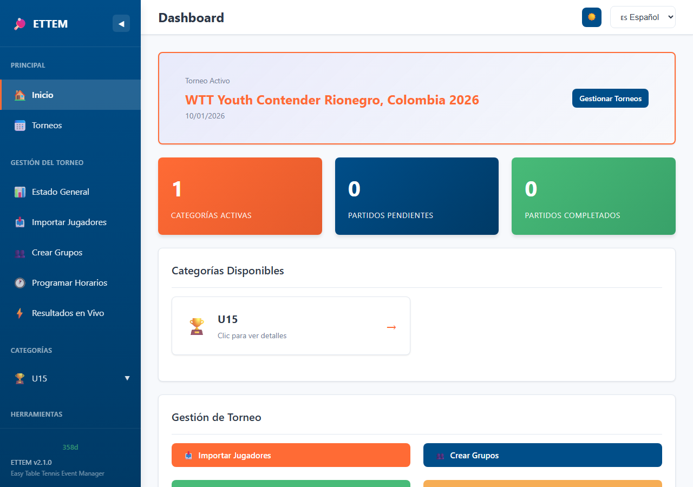

Al ingresar verás el **Dashboard** con:

- Lista de categorías activas
- Estado de cada categoría (jugadores, grupos, fase actual)
- Accesos rápidos a las funciones principales

### Navegación

La **barra lateral izquierda** te permite acceder a:

- **Inicio:** Dashboard principal
- **Categorías:** Lista de todas las categorías
- **Scheduler:** Gestión de mesas y horarios
- **Impresión:** Centro de impresión
- **Configuración:** Idioma y tema

---

## Crear una Categoría

1. En el Dashboard, haz clic en **"Nueva Categoría"**
2. Ingresa el **nombre** usando nomenclatura ITTF:

| Código | Significado |
|--------|-------------|
| U11BS | Under 11 Boys Singles (Varones Sub-11) |
| U13GS | Under 13 Girls Singles (Damas Sub-13) |
| U15BS | Under 15 Boys Singles (Varones Sub-15) |
| MS | Men's Singles (Varones Mayores) |
| WS | Women's Singles (Damas Mayores) |

3. Haz clic en **Crear**

> **Tip:** Usa nombres descriptivos como `U15BS`, `MS`, `WS` para facilitar la organización.

---

## Importar Jugadores

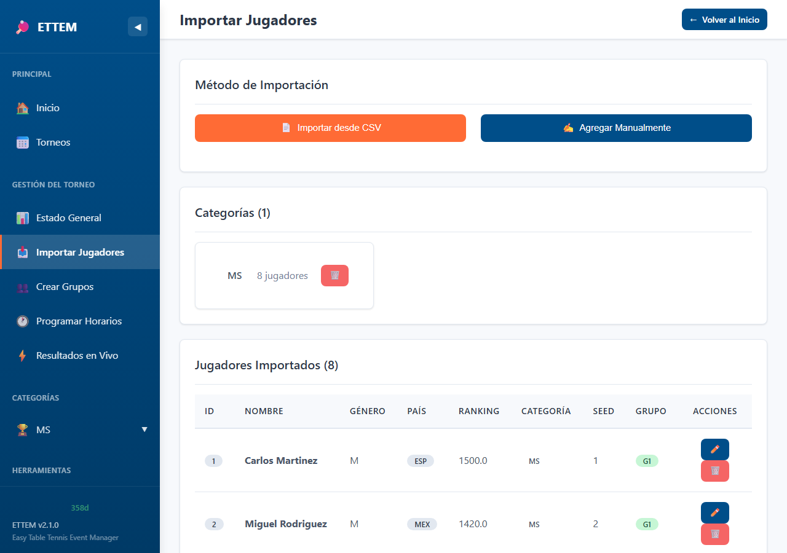

### Opción 1: Desde archivo CSV

1. Ve a la categoría deseada
2. Haz clic en **"Importar Jugadores"**
3. Selecciona tu archivo CSV
4. Revisa la vista previa
5. Haz clic en **Importar**

#### Formato del CSV

Tu archivo CSV debe tener estas columnas:

| Columna | Descripción | Ejemplo |
|---------|-------------|---------|
| `id` | Identificador único | 1, 2, 3... |
| `nombre` | Nombre del jugador | Juan |
| `apellido` | Apellido | Pérez |
| `genero` | M o F | M |
| `pais_cd` | Código ISO-3 del país | ESP, MEX, ARG |
| `ranking_pts` | Puntos de ranking (0 si no tiene) | 1200 |
| `categoria` | Categoría | U15BS |

**Ejemplo de archivo CSV:**
```csv
id,nombre,apellido,genero,pais_cd,ranking_pts,categoria
1,Juan,Pérez,M,ESP,1200,U15BS
2,María,García,F,ESP,1150,U15GS
3,Pedro,López,M,MEX,0,U15BS
```

### Opción 2: Agregar manualmente

1. Ve a la categoría deseada
2. Haz clic en **"Agregar Jugador"**
3. Completa el formulario
4. Haz clic en **Guardar**

> **Nota:** Los jugadores con `ranking_pts=0` se consideran "sin ranking" y se ordenan después de los jugadores rankeados.

---

## Crear Grupos

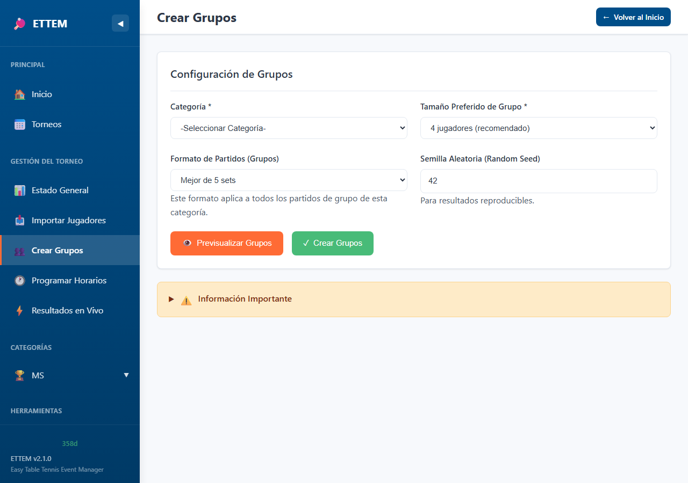

Una vez que tengas jugadores importados:

1. Ve a la categoría
2. Haz clic en **"Crear Grupos"**
3. Configura:
   - **Tamaño preferido de grupo:** 3 o 4 jugadores
   - **Jugadores que avanzan:** 1 o 2 por grupo
4. Revisa la **vista previa** con el seeding snake
5. Opcionalmente, arrastra jugadores para ajustar grupos manualmente
6. Haz clic en **Crear Grupos**

### Snake Seeding

Los jugadores se distribuyen en forma de "serpiente" según su ranking:

```
Grupo A: Seed 1, Seed 4, Seed 5, Seed 8
Grupo B: Seed 2, Seed 3, Seed 6, Seed 7
```

Esto asegura grupos balanceados.

---

## Ingresar Resultados de Grupos

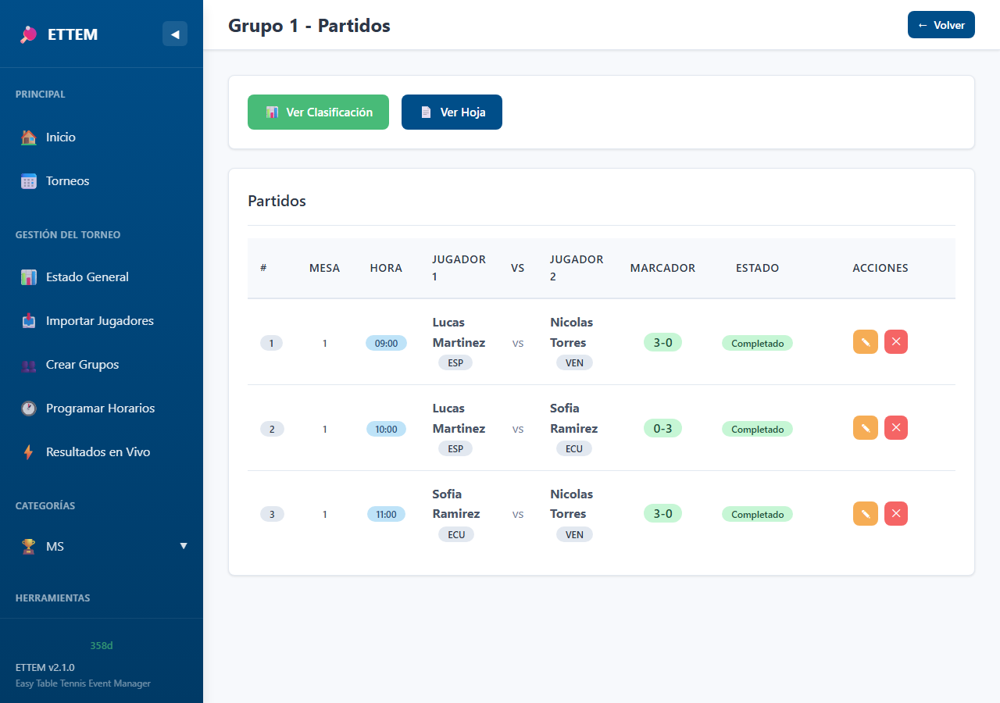

1. Ve a la categoría → pestaña **Grupos**
2. Selecciona un grupo
3. Haz clic en un partido pendiente
4. Ingresa los sets:
   - Cada set tiene formato `XX-YY` (ej: `11-9`, `12-10`)
   - El sistema valida automáticamente las reglas ITTF
5. Haz clic en **Guardar Resultado**

### Reglas de Validación

- Un set se gana a 11 puntos
- Debe haber diferencia de 2 puntos
- En deuce (10-10), el ganador debe tener exactamente +2 (12-10, 13-11, etc.)
- Best of 3: Primero en ganar 2 sets
- Best of 5: Primero en ganar 3 sets
- Best of 7: Primero en ganar 4 sets

### Walkover (W.O.)

Si un jugador no se presenta:

1. Haz clic en el partido
2. Selecciona **Walkover**
3. Indica el **ganador**
4. El perdedor recibe 0 puntos de torneo

---

## Ver Standings

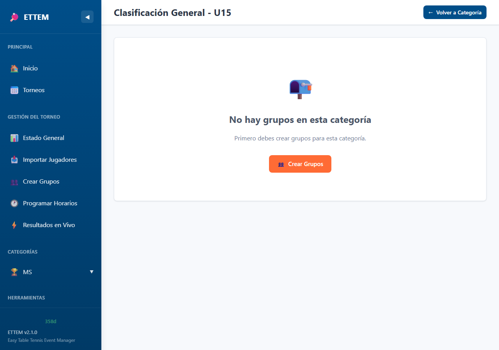

Los standings se calculan automáticamente:

1. Ve a la categoría → pestaña **Standings**
2. Verás la clasificación de cada grupo

### Sistema de Puntos

| Resultado | Puntos |
|-----------|--------|
| Victoria | 2 |
| Derrota (jugada) | 1 |
| Derrota por W.O. | 0 |

### Desempates

Cuando hay empate en puntos, se aplica (solo entre los empatados):

1. **Ratio de sets:** sets ganados / sets perdidos
2. **Ratio de puntos:** puntos ganados / puntos perdidos
3. **Seed:** el mejor seed gana el desempate

---

## Generar Bracket (Llave)

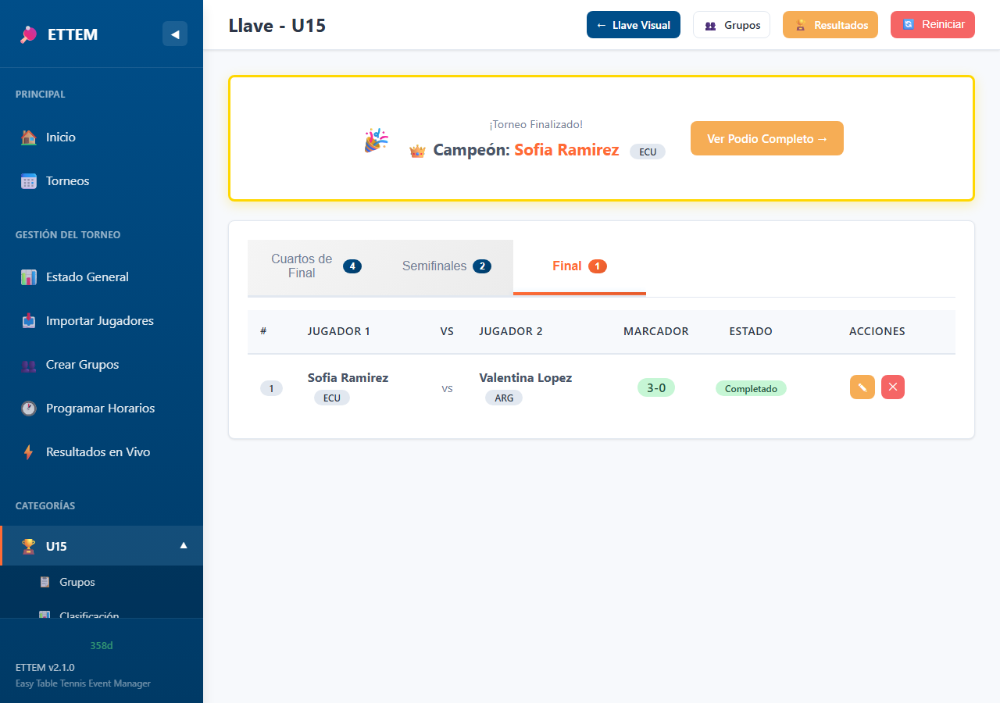

Cuando todos los partidos de grupos estén completos:

1. Ve a la categoría → pestaña **Bracket**
2. Elige el modo:

### Modo Automático

- Genera el bracket siguiendo reglas ITTF
- G1 (mejor 1° lugar) va arriba
- G2 (segundo mejor 1°) va abajo
- Los 2° lugares van en la mitad opuesta a su grupo
- Los BYEs se colocan según posiciones ITTF oficiales

### Modo Manual (Drag & Drop)

- Arrastra jugadores a los slots deseados
- El sistema valida:
  - No pueden estar en la misma mitad jugadores del mismo grupo
  - Advertencias visuales si hay compatriotas en primera ronda

---

## Ingresar Resultados de Knockout

1. Ve a la categoría → pestaña **Bracket**
2. Haz clic en un partido de la llave
3. Ingresa los sets (igual que en grupos)
4. El ganador avanza automáticamente a la siguiente ronda

> **Tip:** Puedes configurar diferente formato para grupos y knockout (ej: Bo3 en grupos, Bo5 en bracket).

---

## Scheduler (Mesas y Horarios)

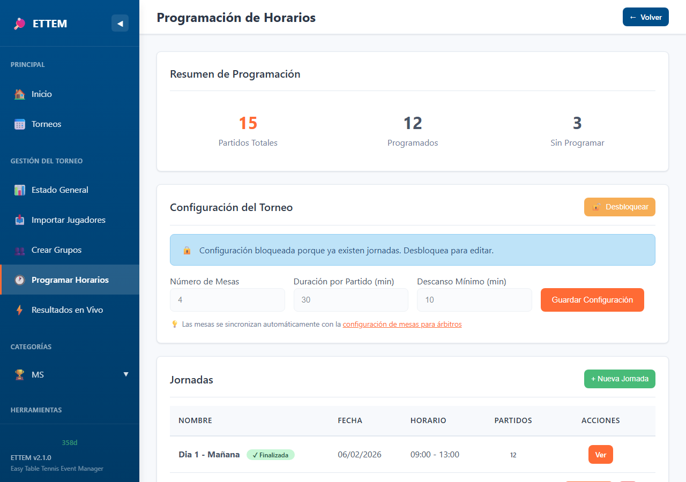

El scheduler te permite organizar partidos por mesa y hora.

### Configurar Mesas

1. Ve a **Scheduler** → **Configuración**
2. Indica cuántas mesas tienes disponibles
3. Nombra cada mesa (ej: Mesa 1, Mesa 2...)

### Crear Sesión

1. Ve a **Scheduler** → **Nueva Sesión**
2. Configura:
   - **Nombre:** ej. "Mañana", "Tarde", "Día 1"
   - **Hora de inicio**
   - **Duración de cada slot** (ej: 20 minutos)
   - **Cantidad de slots**
3. Haz clic en **Crear**

### Asignar Partidos

1. Ve a la sesión creada
2. Verás una **grilla** con mesas (columnas) y horarios (filas)
3. Haz clic en una celda vacía
4. Selecciona el partido a asignar
5. El partido aparecerá en la grilla

### Resultados en Vivo (Admin)


Desde **Resultados en Vivo** en la barra lateral puedes monitorear todos los partidos en curso, agrupados por horario. Los partidos se actualizan automáticamente cuando los árbitros ingresan resultados desde sus celulares.

### Finalizar Sesión

Cuando termines una sesión:

1. Haz clic en **Finalizar Sesión**
2. Los partidos asignados quedan bloqueados
3. Puedes **Reabrir** si necesitas hacer cambios

---

## Centro de Impresión

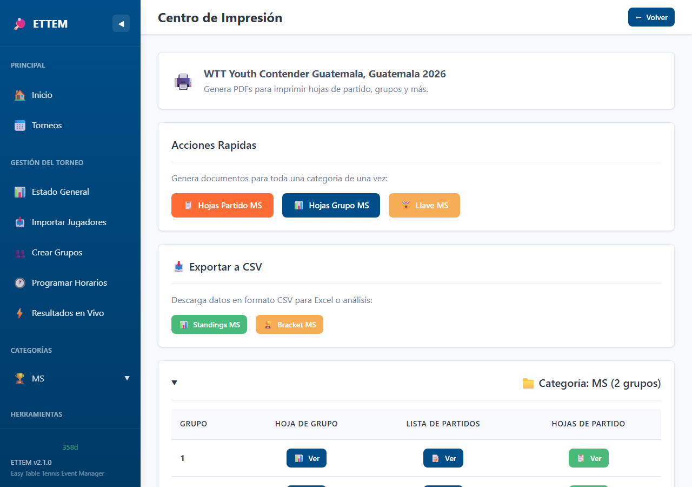

Accede desde **Impresión** en la barra lateral.

### Documentos Disponibles

| Documento | Descripción |
|-----------|-------------|
| **Hoja de Partido** | Para que el árbitro anote el resultado |
| **Hoja de Grupo** | Matriz de resultados del grupo |
| **Llave (Bracket)** | Visualización del bracket eliminatorio |
| **Grilla de Scheduler** | Asignaciones de mesas y horarios |

### Cómo Imprimir

1. Selecciona el tipo de documento
2. Elige la categoría y/o grupo
3. Haz clic en **Vista Previa**
4. En la vista previa, usa **Ctrl+P** (o Cmd+P en Mac) para imprimir
5. Opcionalmente, descarga como PDF

> **Tip:** Usa "Guardar como PDF" en el diálogo de impresión para crear archivos PDF.

---

## Configurar Mesas para Árbitros

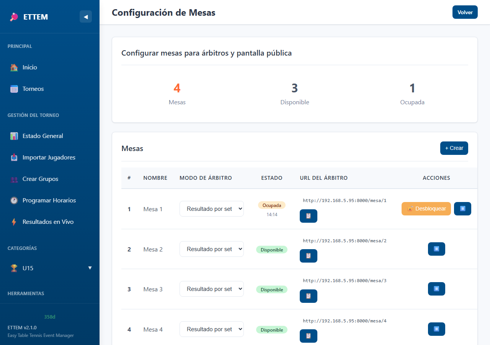

Desde la versión 2.2, puedes configurar mesas físicas para que los árbitros ingresen resultados desde sus celulares.

### Inicializar Mesas

1. Ve a **Configurar Mesas** en la barra lateral
2. Indica cuántas mesas tienes
3. Haz clic en **Inicializar**
4. Cada mesa recibirá un número y una URL única

### Modos de Árbitro

Cada mesa puede funcionar en uno de dos modos:

| Modo | Descripción |
|------|-------------|
| **Resultado por set** | El árbitro ingresa el marcador final de cada set (ej: 11-9) |
| **Punto por punto** | El árbitro toca un botón por cada punto anotado |

### Códigos QR

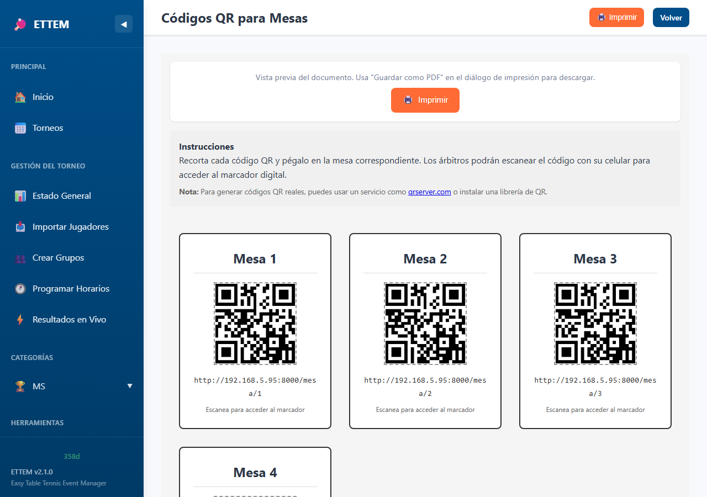

1. Haz clic en **QR Codes** para ver los códigos de todas las mesas
2. Imprime la página y coloca cada QR en la mesa correspondiente
3. Los árbitros escanean el QR con su celular para acceder al marcador

### Bloqueo de Mesas

- Solo **un dispositivo** puede controlar cada mesa a la vez
- Si un árbitro ya está usando una mesa, otro dispositivo verá un mensaje de "Mesa ocupada"
- El administrador puede **desbloquear** una mesa desde el panel si es necesario

---

## Marcador de Árbitro

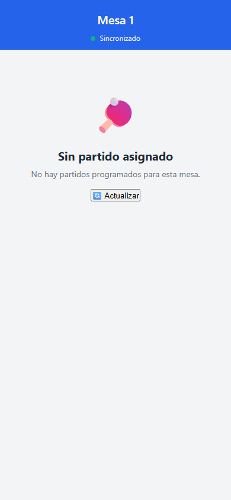

El marcador es una interfaz optimizada para celular que permite al árbitro controlar el partido.

### Acceder al Marcador

1. Escanea el **código QR** de la mesa, o
2. Ingresa la URL directamente: `http://<IP-del-servidor>:8000/mesa/1`

> **Nota:** El celular debe estar conectado a la **misma red WiFi** que la computadora del servidor.

### Seleccionar Partido

1. Al abrir la mesa, verás los partidos programados para hoy
2. Selecciona el partido que vas a arbitrar
3. El marcador se activará con los nombres de ambos jugadores

### Marcador Activo


Una vez seleccionado el partido, verás el marcador con botones grandes para anotar puntos. El marcador muestra:

- Nombre de ambos jugadores con colores diferenciados
- Marcador de sets (arriba)
- Puntos del set actual (centro)
- Botones **+** para anotar punto y **-** para corregir
- Botón **Intercambiar lados** para cambiar posición visual
- Botón **Deshacer** para revertir el último punto

### Ingresar Resultado por Set

1. Al completar un set, ingresa el marcador (ej: 11-8)
2. El sistema valida las reglas ITTF automáticamente
3. Cuando el partido termine, el resultado se guarda y aparece en la pantalla pública

### Walkover desde el Marcador


Si un jugador no se presenta:

1. Selecciona el partido
2. Toca **Walkover**
3. Elige al jugador **ganador**
4. El partido se marca como completado

---

## Pantalla Pública

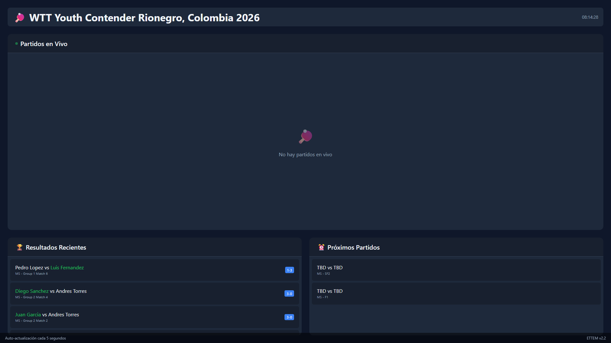

La pantalla pública muestra los resultados en tiempo real, ideal para proyectar en un monitor o TV en la sede del torneo.

### Acceder

Abre `http://<IP-del-servidor>:8000/display` en el navegador del monitor/TV.

### Información Mostrada

- **Partidos en vivo:** Marcador actual de los partidos en progreso
- **Resultados recientes:** Últimos partidos completados
- **Próximos partidos:** Partidos programados pendientes

### Características

- **Auto-refresh:** Se actualiza automáticamente cada 5 segundos
- **Tema oscuro:** Optimizado para pantallas grandes
- **Responsive:** Se adapta a resoluciones Full HD (1080p) y 4K
- **Rotación automática:** Alterna entre resultados y próximos partidos

> **Tip:** Usa el modo de pantalla completa del navegador (F11) para aprovechar todo el espacio.

### Configuración de Red

Para que la pantalla pública y los celulares de los árbitros accedan al servidor:

1. Asegúrate de que todos estén en la **misma red WiFi**
2. En Windows, abre el puerto en el firewall:
   ```cmd
   netsh advfirewall firewall add rule name="ETTEM Server" dir=in action=allow protocol=TCP localport=8000
   ```
3. Encuentra tu IP local con `ipconfig` y busca la dirección IPv4

---

## Configuración

### Cambiar Idioma

1. Ve a **Configuración**
2. Selecciona **Español** o **English**
3. La interfaz se actualiza inmediatamente

### Cambiar Tema

1. Ve a **Configuración**
2. Selecciona **Claro** u **Oscuro**

> **Tip:** El tema oscuro es ideal para usar de noche o en ambientes con poca luz.

---

## Preguntas Frecuentes

### ¿Dónde se guardan mis datos?

En la carpeta `.ettem/` junto al ejecutable (o en tu directorio de usuario). Contiene:
- `ettem.sqlite` - Base de datos con todos los torneos
- `license.key` - Tu clave de licencia

### ¿Puedo hacer backup de mis datos?

Sí, simplemente copia la carpeta `.ettem/` a otro lugar seguro.

### ¿Puedo usar la misma licencia en otra computadora?

Sí, puedes ingresar la misma clave en otra computadora. Sin embargo, los datos de torneo no se sincronizan automáticamente.

### ¿Qué pasa si mi licencia expira durante un torneo?

Podrás ver los datos existentes pero no podrás ingresar nuevos resultados hasta renovar.

### ¿Cómo cambio un resultado ya ingresado?

1. Ve al partido en cuestión
2. Haz clic en **Editar Resultado**
3. Modifica los sets
4. Guarda los cambios

> **Nota:** Si el partido de bracket ya avanzó, es posible que necesites ajustar resultados posteriores.

### ¿Puedo eliminar una categoría?

Sí, pero se eliminarán todos los jugadores, grupos, partidos y resultados de esa categoría. Esta acción no se puede deshacer.

### El programa no abre / se cierra inmediatamente

- Verifica que tienes una licencia válida
- Intenta ejecutar desde línea de comandos para ver errores:
  ```cmd
  ETTEM.exe --help
  ```
- Contacta soporte si el problema persiste

### ¿Cómo actualizo a una nueva versión?

1. Descarga el nuevo `ETTEM.exe`
2. Reemplaza el archivo anterior
3. Tus datos se conservan (están en `.ettem/`)

---

## Soporte

¿Tienes preguntas o problemas?

- Revisa esta guía
- Contacta al proveedor de tu licencia

---

*ETTEM v2.2.0 - Easy Table Tennis Event Manager*
